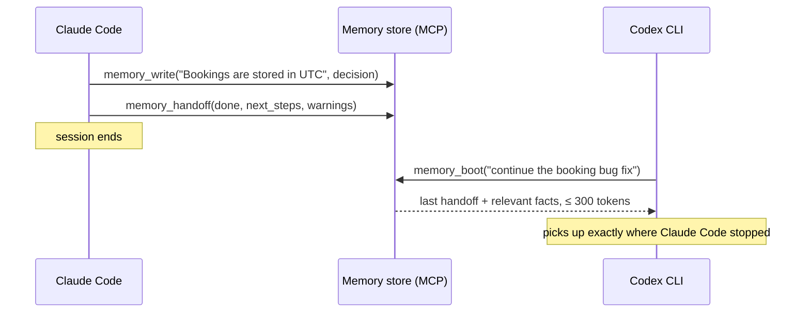

# Agent Memory Engine

**One shared memory for your coding agents — Claude Code, Codex CLI, Cursor — over MCP, with token-budgeted recall so it never floods a context window.**

Every coding agent forgets everything between sessions, and none of them can read another's notes: what Claude Code learned about your codebase is invisible to Codex, and vice versa. The common fix — a pile of Markdown memory files loaded into every prompt — has the opposite problem: it burns more tokens every week as the pile grows.

This engine is the small piece in between. Agents write atomic facts, decisions and handoffs to one store; at the start of a task any agent recalls **only the memories relevant to that task, under a hard token budget you set**. It runs as a [Model Context Protocol](https://modelcontextprotocol.io) server, so every MCP-capable agent shares the same memory — and every memory records which agent wrote it.

> This engine is the working evolution of the Markdown memory *convention* this repository originally hosted — still included and usable in [`scaffold/`](scaffold/) — into a measured retrieval *system*.

## Results

On a hand-labeled benchmark of an agent working across many sessions on one codebase (14 durable memories, 7 fresh-session tasks, top-k = 3):

| Arm | Avg context tokens | Recall | Precision | Tokens saved vs baseline |
| --- | ---: | ---: | ---: | ---: |
| No memory (control) | 0 | 0.00 | 0.00 | 100% |
| Full context (baseline — load every memory) | 424 | 1.00 | 0.10 | 0% |
| *Random k (control)* | *93* | *0.07* | *0.05* | *78%* |
| **Targeted retrieval (this engine)** | **93** | **0.93** | **0.43** | **78%** |
| **Budget recall (≤ 120 tokens, hard cap)** | **93** | **0.93** | **0.43** | **78%** |

**Read the random row first.** It loads three memories picked at random, so it reports the *same* 78% token saving with 0.07 recall. The saving is arithmetic — you loaded 3 of 14 memories — and proves nothing on its own. The claim worth making is the **0.86 recall gap between random and retrieval at identical token cost**.

Reproduce with `python eval/run_eval.py`; the full report is in [eval/results.md](eval/results.md).

### What these numbers don't show

- **The default embedder is lexical, not semantic.** It is feature hashing over word and character n-grams, so it matches shared wording. Re-run the same tasks with paraphrased queries that avoid the memories' vocabulary and recall drops from **0.93 to 0.43**. That gap is published in the results, not tuned away, and it is the reason the optional `sentence-transformers` backend exists.

  | Query phrasing | Word overlap with gold | Recall |
  | --- | ---: | ---: |
  | Developer phrasing (as labelled) | 40% | 0.93 |
  | Outsider paraphrase | 3% | 0.43 |

- **The precision column is nearly meaningless for the baseline.** Full context scores 0.10 because that is `|relevant| / |store|` — an artefact of loading everything.
- **7 tasks, 10 gold labels, written by the same person who wrote the retriever.** One retrieval either way moves recall by ~0.07. This is an engineering check, not a production-scale claim.

### Does the cost stay flat as the store grows?

Adding unrelated memories from the same project, re-measuring against the same labels:

| Memories in store | Full context tokens | Budget recall tokens | Budget recall |
| ---: | ---: | ---: | ---: |
| 14 | 424 | 93 | 0.93 |
| 34 | 805 | 87 | 0.93 |
| 54 | 1159 | 82 | 0.93 |

The baseline grows with the store. The budgeted arm does not, and recall holds.

## The cross-agent loop



Three habits, three tools:

- **`memory_boot(task, budget_tokens)`** — call once at session start: the latest handoff from the *previous agent, whichever tool it was*, plus the memories most relevant to the task, packed under one token budget.
- **`memory_write(text, type)`** — persist a durable fact, decision or issue the moment it's learned. Near-duplicates are dropped, and the tool says so rather than reporting a save that didn't happen.
- **`memory_handoff(done, next_steps, warnings)`** — call at session end so the next agent continues instead of rediscovering.

Plus `memory_list`, `memory_update` and `memory_forget`, because memory you cannot correct is worse than no memory: a stale `state` entry keeps being recalled and quietly misleads every later session.

Tool outputs are deliberately compact — no scores, no timestamps — because everything a memory tool returns is paid for again in the calling agent's context window. The flip side is that the agent can't judge relevance itself, so weak matches are filtered out before they're returned (see [Relevance floor](#relevance-floor)).

## Hook it up to your agents

```bash
pip install -e ".[mcp]"
```

Works with both `mcp` 1.x and 2.x. Point every agent at the **same store path**, and give each its own name:

**Claude Code**

```bash
claude mcp add agent-memory -e AGENT_MEMORY_PATH=~/.agent_memory/store.json \
  -e AGENT_MEMORY_AGENT=claude-code -- agent-memory-mcp
```

**Codex CLI** (`~/.codex/config.toml`)

```toml
[mcp_servers.agent-memory]
command = "agent-memory-mcp"
env = { AGENT_MEMORY_PATH = "~/.agent_memory/store.json", AGENT_MEMORY_AGENT = "codex" }
```

**Cursor** (`.cursor/mcp.json`)

```json
{
  "mcpServers": {
    "agent-memory": {
      "command": "agent-memory-mcp",
      "env": {
        "AGENT_MEMORY_PATH": "~/.agent_memory/store.json",
        "AGENT_MEMORY_AGENT": "cursor"
      }
    }
  }
}
```

Each memory now carries its origin (`[decision · claude-code]`, `[handoff · codex]`), and a handoff written in one tool is picked up by the next via `memory_boot`. Agents may run at the same time: writes take a lock, merge, and land atomically, and an already-running server picks up another agent's writes on its next read.

## How it works

- **Pluggable embedder** ([embeddings.py](src/agent_memory/embeddings.py)) — a small `Embedder` protocol with two backends: a dependency-free, deterministic `HashingEmbedder` (default; runs offline and in CI) and a `SentenceTransformerEmbedder` for real semantic embeddings. Same API, swap by installing one package. Each carries its own calibrated relevance floor, because the two score on different scales.
- **Vector store** ([store.py](src/agent_memory/store.py)) — exact brute-force cosine over a numpy matrix, JSON persistence, near-duplicate suppression on write, and greedy **budget packing**: recall walks results in relevance order and skips anything that would overflow the caller's token budget. An agent's memory is hundreds of entries, not millions, so this is instant and exact; FAISS/Chroma can slot behind the same API later.
- **Durable writes** — every write takes a cross-process lock, re-reads anything another agent appended, and replaces the file atomically. A crash mid-write cannot truncate the store, and two agents writing at once cannot silently overwrite each other. Embeddings are stored as base64 float16, which keeps the file about 5× smaller than JSON float lists.
- **MCP server** ([mcp_server.py](src/agent_memory/mcp_server.py)) — exposes `memory_boot`, `memory_recall`, `memory_write`, `memory_handoff`, `memory_list`, `memory_update`, `memory_forget` and `memory_stats` as agent tools.
- **Evaluation harness** ([run_eval.py](eval/run_eval.py)) — measures token cost and retrieval precision/recall across five arms, including the random control and the hard-budget arm, plus the paraphrase gap, a store-growth scaling test and the relevance-floor sweep.

### Relevance floor

Without a floor, a query about something the store knows nothing about still returns *k* memories — and since tool output hides the scores, the calling agent has no way to tell noise from signal. `min_score` drops weak matches. The shipped default comes from a published sweep:

| min_score | Labelled recall | Off-topic memories returned |
| ---: | ---: | ---: |
| 0.00 | 0.93 | 12/12 |
| 0.10 | 0.93 | 10/12 |
| **0.15** | **0.93** | **6/12** |
| 0.20 | 0.93 | 2/12 |

The floor lives on the embedder (`HashingEmbedder.recommended_min_score = 0.15`), overridable with `AGENT_MEMORY_MIN_SCORE` or the `--min-score` flag. A higher floor cuts more noise on this benchmark, but the lowest-scoring genuinely-relevant memory in it sits at 0.13, so the default stays close to that observed edge. The `sentence-transformers` value is **not** calibrated here — measure it on your own store.

## Quickstart (60 seconds)

```bash
pip install -e ".[dev]"     # engine, CLI, MCP server, exact tokenizer
python eval/run_eval.py     # reproduce the results above
python examples/quickstart.py

agent-memory --agent claude-code write "Bookings are stored in UTC." --type decision
agent-memory --agent claude-code handoff --done "Fixed double emails." --next "Add rate limiting."
agent-memory boot "continue the rate limiting work" --budget 200
agent-memory list                                   # ids, so you can fix mistakes
agent-memory update mem_0003 "Bookings are stored in UTC; the UI converts."
agent-memory forget mem_0007
```

In Python:

```python
from agent_memory import MemoryStore

store = MemoryStore(path="~/.agent_memory/store.json")
store.write("The chatbot uses Google Gemini in server/gemini-chat.ts.",
            type="decision", agent="claude-code")

handoff, hits = store.boot("where is the chatbot configured", budget_tokens=150)
for hit in hits:
    print(hit.score, hit.entry.text)
```

## Real semantic embeddings

```bash
pip install -e ".[real]"    # sentence-transformers + tiktoken
```

`default_embedder()` prefers the real model when installed, and warns on stderr if it falls back rather than switching silently. Force the offline embedder with `AGENT_MEMORY_EMBEDDER=hashing` (CI does this for stable numbers), or demand the real one with `AGENT_MEMORY_EMBEDDER=sentence-transformers` to turn a missing dependency into an error instead of a downgrade.

Switching backends on an existing store is safe: vectors from a different embedder aren't comparable, so the store detects the mismatch on load and re-embeds from the stored text instead of returning meaningless scores.

## Migrate an existing Markdown scaffold

```bash
python scripts/ingest_markdown.py path/to/agent-memory/ --path ~/.agent_memory/store.json
```

One memory per `##` section, with long sections split so that every ingested memory stays small enough to be recalled under a budget.

## Limits and trust boundary

- **Memories are injected into agent context verbatim.** Anything an agent writes to the store — including text it read from a webpage, an issue tracker or a dependency — will be replayed into a *different* agent's context later, where it reads as trusted project knowledge. Don't point a shared store at untrusted input, and skim `agent-memory list` occasionally.
- **The store is a local file.** No auth, no encryption, no server. It belongs next to your code, not on a shared host.
- **Retrieval is lexical by default.** See the paraphrase gap above.
- **The benchmark is small and self-authored.** It is a regression check for the engine, not evidence about your codebase.

## Develop

```bash
pip install -e ".[dev]"
pytest -q
```

CI runs the suite on Python 3.10 and 3.12, runs the evaluation and fails if the committed results are stale, and separately tests the MCP server against both `mcp` 1.x and 2.x.

## Roadmap

- LLM-based compaction: summarize/dedup `state` and `worklog` memories, extract durable facts from a raw session transcript.
- Recency- and type-aware ranking (decay old `state`, never drop `decision`).
- `sentence-transformers` numbers published alongside the hashing baseline in CI, including a calibrated relevance floor.
- Optional FAISS backend for large stores.

## License

MIT
