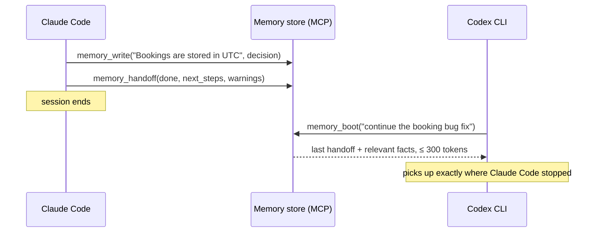
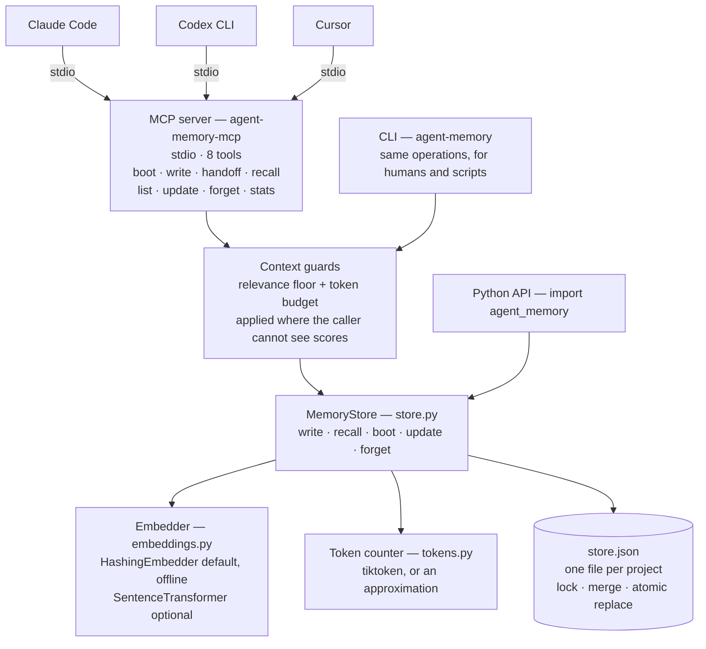
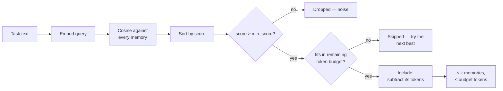
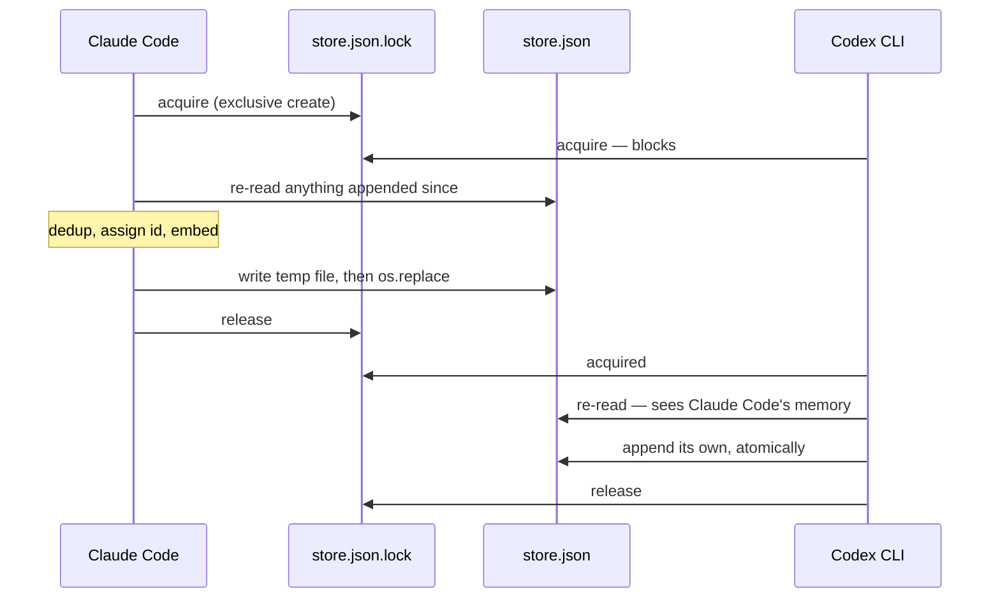

# Agent Memory Engine

[](https://github.com/Ninadnj/ai-agent-memory-scaffold/actions/workflows/ci.yml)
[](https://www.python.org/downloads/)
[](LICENSE)

**One shared memory for your coding agents — Claude Code, Codex CLI, Cursor — over MCP, with token-budgeted recall so it never floods a context window.**

Coding agents forget everything between sessions, and none of them can read another's notes: what Claude Code learned about your codebase is invisible to Codex. The usual fix — a pile of Markdown files loaded into every prompt — has the opposite problem, costing more tokens every week as the pile grows.

This engine sits in between. Agents write short, atomic memories to one store; at the start of a task, any agent gets back **only the memories relevant to that task, under a token budget you set**. It runs as a [Model Context Protocol](https://modelcontextprotocol.io) server, so every MCP-capable tool shares the same memory, and every memory records which agent wrote it.

> The original Markdown *convention* this repository hosted is still here and still usable, in [`scaffold/`](scaffold/). This engine is its measured successor.

---

## Quick start

```bash
git clone https://github.com/Ninadnj/ai-agent-memory-scaffold.git
cd ai-agent-memory-scaffold
pip install -e ".[mcp,real]"
```

| Install | Gets you |
| --- | --- |
| `pip install -e .` | Engine + CLI. numpy only, fully offline. |
| `pip install -e ".[mcp,real]"` | **Recommended.** Adds the MCP server and semantic embeddings. |
| `pip install -e ".[dev]"` | Everything above minus the model, plus pytest. What CI runs. |

Try it in your terminal:

```bash
agent-memory write "Bookings are stored in UTC; the UI converts to local time." --type decision
agent-memory write "Admin routes are guarded by requireAdmin in server/auth.ts." --type decision

agent-memory recall "a client saw the wrong hour for their appointment"
# 0.41  [decision] Bookings are stored in UTC; the UI converts to local time.

agent-memory recall "best sourdough bread recipe"
# No relevant memories.
```

That first query shares no words with the memory it found, and the second returns nothing rather than guessing. Both behaviours are the point.

---

## How it works

Three habits, three tools:

| Tool | When | What it does |
| --- | --- | --- |
| `memory_boot(task, budget_tokens)` | Start of a session | Returns the previous agent's handoff plus the memories most relevant to your task, packed under one token budget. |
| `memory_write(text, type)` | The moment something is learned | Saves one durable fact. Near-duplicates are skipped — and it tells you so instead of reporting a save that didn't happen. |
| `memory_handoff(done, next, warnings)` | End of a session | Leaves a note so the next agent continues instead of rediscovering. |

Plus `memory_list`, `memory_update` and `memory_forget` — memory you can't correct is worse than no memory, because a stale note keeps being recalled with full confidence.



Tool output is deliberately compact — no scores, no timestamps — because everything a memory tool returns is paid for again in the calling agent's context window. The trade-off is that the agent can't judge relevance itself, so weak matches are filtered out before they're returned.

---

## Connect your agents

Give each agent its own name. The store needs no configuration — it follows the project you're in.

**Claude Code**

```bash
claude mcp add agent-memory -e AGENT_MEMORY_AGENT=claude-code -- agent-memory-mcp
```

**Codex CLI** — `~/.codex/config.toml`

```toml
[mcp_servers.agent-memory]
command = "agent-memory-mcp"
env = { AGENT_MEMORY_AGENT = "codex" }
```

**Cursor** — `.cursor/mcp.json`

```json
{
  "mcpServers": {
    "agent-memory": {
      "command": "agent-memory-mcp",
      "env": { "AGENT_MEMORY_AGENT": "cursor" }
    }
  }
}
```

Works with `mcp` 1.x and 2.x. Every memory carries its origin (`[decision · claude-code]`, `[handoff · codex]`), and a handoff written in one tool is picked up by the next. Agents may run at the same time: writes take a lock, merge, and land atomically, and a running server sees another agent's writes on its next read.

### Make it run without being asked

Every tool above depends on the model *choosing* to call it — and models forget, especially at the end of a session, because the session just ends. Two mechanisms close that gap.

**Claude Code hooks** (deterministic — the client runs them, not the model):

```bash
agent-memory install-hooks                        # SessionStart + SessionEnd
agent-memory install-hooks --with-prompt-recall   # also inject on every prompt
agent-memory install-hooks --uninstall
```

| Hook | What happens |
| --- | --- |
| `SessionStart` | Injects the previous session's handoff plus a few durable project facts, and records where the repo stood. **No model discipline needed.** |
| `SessionEnd` | Diffs against that marker and saves what actually changed — commits made, files still dirty. Writes nothing if nothing happened. |
| `UserPromptSubmit` *(opt-in)* | Injects memories relevant to what you just asked. Fires on every message, so it costs a model load each time. |

It merges into `.claude/settings.json` without touching hooks belonging to other tools, and re-running replaces its own entries instead of stacking copies. Use `--user` to install for every project.

**MCP server instructions** (vendor-neutral): the server tells any connecting client — Claude Code, Codex, Cursor — when to boot, write and hand off. That reaches the agents where hooks don't exist. Nothing to configure.

**What this honestly does and doesn't do.** The *read* side is now fully automatic: memory arrives without anyone asking for it. The *write* side has a deterministic floor — the session note is derived from git, so it's accurate and always written — but a note saying "committed X, changed Y" is weaker than a handoff explaining *why*. Only the model can write that, so the instructions above push it to. Summarising a session properly would need an LLM call, which this engine deliberately does not make.

### One store per project

Memories are scoped to the repository you're working in:

1. `AGENT_MEMORY_PATH`, if you set it
2. `.agent_memory/store.json` in the current git repository — **the normal case**
3. `~/.agent_memory/store.json`, when you're not in a repository

This matters more than it sounds. Recall matches on similarity alone, so one shared store would let another project's answer to *"how do we deploy?"* surface while you work here.

```bash
agent-memory stats            # which store am I using?
agent-memory --global stats   # the cross-project store, when you want it
```

Add `.agent_memory/` to your `.gitignore` unless you mean to commit the memories — sharing them with a team is reasonable, but it should be deliberate.

---

## Does it actually work?

A hand-labelled benchmark: 14 memories from one codebase, 7 fresh-session tasks, top-k = 3.

| Arm | Avg context tokens | Recall | Tokens saved |
| --- | ---: | ---: | ---: |
| No memory (control) | 0 | 0.00 | 100% |
| Full context — load everything | 424 | 1.00 | 0% |
| *Random k (control)* | *93* | *0.07* | *78%* |
| **Targeted retrieval** | **93** | **0.93** | **78%** |
| **Budget recall (≤ 120 tokens)** | **93** | **0.93** | **78%** |

**Read the random row first.** Three memories picked at random report the *same* 78% saving at 0.07 recall. The saving is arithmetic — you loaded 3 of 14 — and proves nothing by itself. The real claim is the **0.86 recall gap at identical token cost**.

Reproduce with `python eval/run_eval.py`. Full report: [eval/results.md](eval/results.md).

### Cost stays flat as memory grows

| Memories in store | Full context | Budget recall | Recall |
| ---: | ---: | ---: | ---: |
| 14 | 424 tokens | 93 tokens | 0.93 |
| 34 | 805 tokens | 87 tokens | 0.93 |
| 54 | 1159 tokens | 82 tokens | 0.93 |

The baseline grows with the store. The budgeted arm doesn't, and recall holds.

### Which embedder should you use?

The offline default is **lexical** — it matches shared wording, not meaning. So every task in the benchmark carries a second phrasing that deliberately avoids the memories' vocabulary, and both backends are scored on both:

| | Hashing (default, offline) | MiniLM (`real` extra) |
| --- | ---: | ---: |
| Developer phrasing — 40% word overlap | **0.93** | 0.86 |
| Outsider paraphrase — 3% word overlap | 0.43 | **0.79** |
| Average | 0.68 | **0.82** |
| Off-topic queries rejected | 6/12 | **12/12** |

It isn't a clean sweep, and that's the useful finding. **Exact word matching genuinely wins when the words match** — and needs no model download. But everyday use is the second row: you write a memory in March and ask about it in July, in different words.

**Use the `real` extra day to day**; keep hashing for CI, air-gapped machines, or when a ~90 MB download isn't welcome. Switching is safe — a store embedded by one backend is re-embedded on load by the other, never compared across incompatible vectors. Full report: [results_sentence_transformers.md](eval/results_sentence_transformers.md).

### What the numbers don't show

- **7 tasks and 10 gold labels, written by the same person who wrote the retriever.** One retrieval either way moves recall by ~0.07. This is an engineering check, not a production-scale claim.
- **Precision is misleading for the baseline.** Loading everything scores 0.10 simply because that's `|relevant| / |store|`.
- **MiniLM numbers aren't reproduced in CI** — they need a model download. CI regenerates and diffs the hashing results only.

---

## Architecture

Every agent talks to one local store. **MCP is the integration surface** — a stdio server each agent launches as a subprocess. The CLI and Python API are thin alternatives onto the same engine.



The guards sit between the tools and the store on purpose: the caller is a model that cannot see similarity scores, so the floor and the budget are enforced before anything is handed back. A Python caller *can* see scores, so `MemoryStore.recall()` applies no floor unless asked.

| Module | Responsibility |
| --- | --- |
| [`mcp_server.py`](src/agent_memory/mcp_server.py) | MCP tools over stdio. Supports `mcp` 1.x and 2.x. |
| [`cli.py`](src/agent_memory/cli.py) | The same operations as shell commands. |
| [`store.py`](src/agent_memory/store.py) | Retrieval, budget packing, durability, on-disk format. |
| [`embeddings.py`](src/agent_memory/embeddings.py) | `Embedder` protocol, two backends, per-backend relevance floor. |
| [`tokens.py`](src/agent_memory/tokens.py) | Token accounting — the unit the budget is denominated in. |
| [`eval/run_eval.py`](eval/run_eval.py) | Five-arm benchmark, paraphrase gap, scaling test, floor sweep. |

### The recall path

Retrieval is exact brute-force cosine over a numpy matrix. One project's memory is hundreds of entries, not millions, so this is both instant and exact; FAISS or Chroma can slot in behind the same API if that ever changes.



Budget packing is greedy, not all-or-nothing: an entry that would overflow the remaining budget is skipped so a smaller, lower-ranked one gets its chance. `memory_boot` spends one budget across both the handoff and the recalled memories, so the total is capped whatever the store holds.

**The relevance floor** exists because without it, a query about something the store knows nothing about still returns *k* memories — and tool output hides the scores, so the agent can't tell. Each backend carries its own value, since they score on different scales:

| Backend | Floor | Chosen because |
| --- | ---: | --- |
| `HashingEmbedder` | 0.15 | No labelled recall lost, off-topic matches halved. The lowest-scoring genuinely relevant memory sits at 0.13, so the floor stays near that observed edge. |
| `SentenceTransformerEmbedder` | 0.20 | Off-topic queries are fully rejected from 0.15 and recall is flat to 0.35, so the sweep alone can't choose. Set just under 0.22 — the score of a real paraphrase against the memory that answers it. |

Override with `AGENT_MEMORY_MIN_SCORE` or `--min-score`. The honest consequence: when a query is genuinely ambiguous, recall returns *nothing* rather than a coin flip the agent would read as fact.

### The write path

The store is a single JSON file, but writes are careful, because the whole point is that several agents share it.



- **No lost updates.** A write re-reads under the lock, so an agent idle for an hour appends rather than overwrites. Verified with 8 concurrent processes.
- **No torn files.** Contents land via `os.replace`, which is atomic — a crash mid-write leaves the previous store intact.
- **Fresh reads.** A long-running server reloads when the file changes, so it sees other agents' writes without a restart.
- **Compact.** Embeddings are base64 float16, roughly 5× smaller than JSON float lists.

---

## Reference

### CLI

```bash
agent-memory write "<text>" --type decision      # save a memory
agent-memory recall "<query>" -k 3 --budget 200  # find relevant memories
agent-memory boot "<task>" --budget 300          # handoff + relevant memories
agent-memory handoff --done "..." --next "..."   # leave a note for the next session
agent-memory list --type decision                # ids, so you can fix mistakes
agent-memory update mem_0003 "<new text>"        # revise a memory
agent-memory forget mem_0007                     # delete a stale memory
agent-memory stats                               # store path, counts, embedder
agent-memory install-hooks                       # run memory automatically (Claude Code)
```

Global flags: `--path` (explicit store), `--global` (cross-project store), `--agent` (who is writing).

### Memory types

`project` · `decision` · `issue` · `state` · `handoff` · `worklog` · `fact`

They mirror the original Markdown scaffold's files, so migration is one-to-one.

### Environment variables

| Variable | Default | Purpose |
| --- | --- | --- |
| `AGENT_MEMORY_PATH` | project store | Force a specific store file. |
| `AGENT_MEMORY_AGENT` | *(empty)* | Name recorded on every memory this agent writes. |
| `AGENT_MEMORY_EMBEDDER` | `auto` | `hashing` forces offline; `sentence-transformers` makes a missing model an error instead of a silent downgrade. |
| `AGENT_MEMORY_MIN_SCORE` | per-backend | Override the relevance floor. |

### Python

```python
from agent_memory import MemoryStore, default_store_path

store = MemoryStore(path=default_store_path())   # this project's store
store.write("The chatbot uses Google Gemini in server/gemini-chat.ts.",
            type="decision", agent="claude-code")

handoff, hits = store.boot("where is the chatbot configured", budget_tokens=150)
for hit in hits:
    print(hit.score, hit.entry.text)
```

### Migrate an existing Markdown scaffold

```bash
python scripts/ingest_markdown.py path/to/agent-memory/ --path .agent_memory/store.json
```

One memory per `##` section, with long sections split so every ingested memory stays small enough to be recalled under a budget.

---

## Limits

- **Automatic writes are deterministic, not insightful.** With hooks installed, every session saves an accurate git-derived note, and reads need no prompting at all. But a handoff explaining *why* something was done still depends on the model choosing to write one — the server's instructions push for it, and this engine makes no LLM call of its own.
- **Memories never expire.** `state` and `worklog` entries go stale but keep being recalled as confidently as a fresh decision. Correct them with `memory_update` / `memory_forget` until decay lands.
- **Retrieval is lexical unless you install the `real` extra.** See [the comparison](#which-embedder-should-you-use).
- **Memories are replayed verbatim into other agents' context.** Anything an agent writes — including text it read from a webpage, an issue tracker or a dependency — later reads as trusted project knowledge. Don't point a shared store at untrusted input, and skim `agent-memory list` occasionally.
- **The store is a local file.** No auth, no encryption, no server. It belongs next to your code, not on a shared host.
- **The benchmark is small and self-authored.** It's a regression check for the engine, not evidence about your codebase.

## Develop

```bash
pip install -e ".[dev]"
pytest -q
```

74 tests. CI runs the suite on Python 3.10 and 3.12, runs the evaluation and fails if the committed results are stale, and separately tests the MCP server against both `mcp` 1.x and 2.x. Tests for the optional semantic backend skip automatically unless the `real` extra is installed.

## Roadmap

- Recency- and type-aware ranking (decay old `state`, never drop `decision`).
- LLM-based compaction: summarise and dedup `state`/`worklog`, extract durable facts from a session transcript.
- Optional FAISS backend for large stores.

## License

MIT
