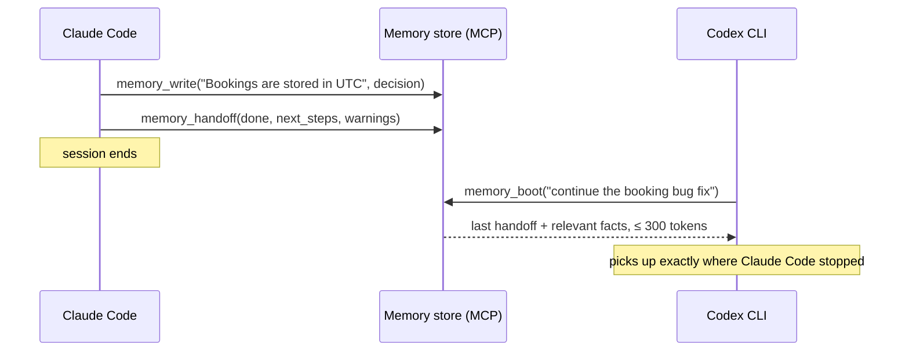
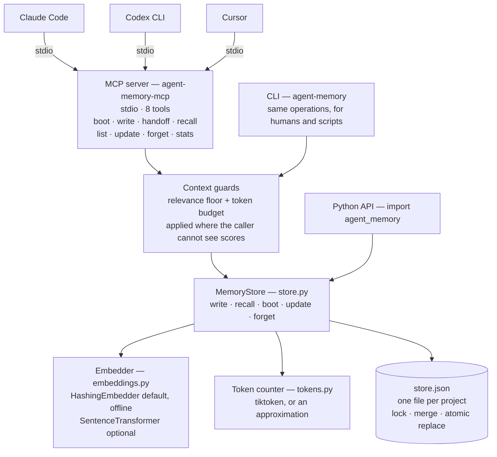
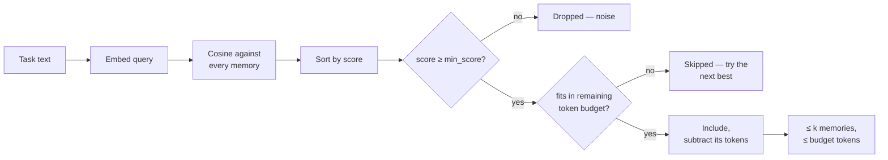
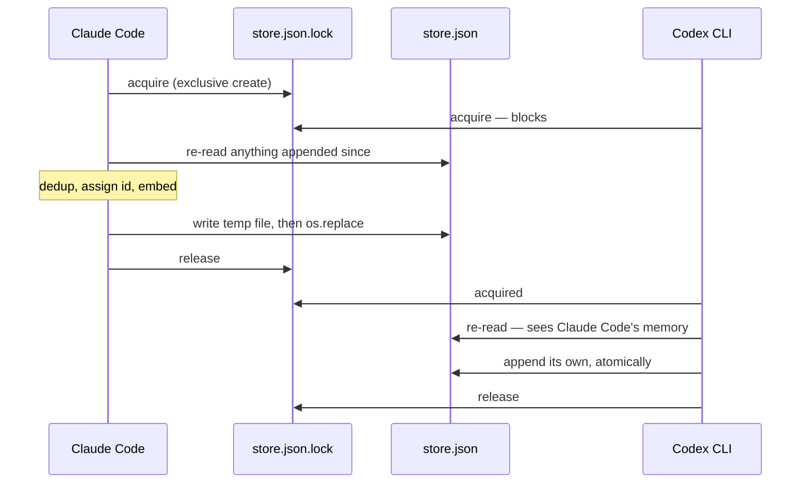

# Agent Memory Engine

**One shared memory for your coding agents — Claude Code, Codex CLI, Cursor — over MCP, with token-budgeted recall so it never floods a context window.**

Every coding agent forgets everything between sessions, and none of them can read another's notes: what Claude Code learned about your codebase is invisible to Codex, and vice versa. The common fix — a pile of Markdown memory files loaded into every prompt — has the opposite problem: it burns more tokens every week as the pile grows.

This engine is the small piece in between. Agents write atomic facts, decisions and handoffs to one store; at the start of a task any agent recalls **only the memories relevant to that task, under a hard token budget you set**. It runs as a [Model Context Protocol](https://modelcontextprotocol.io) server, so every MCP-capable agent shares the same memory — and every memory records which agent wrote it.

> This engine is the working evolution of the Markdown memory *convention* this repository originally hosted — still included and usable in [`scaffold/`](scaffold/) — into a measured retrieval *system*.

## Results

On a hand-labeled benchmark of an agent working across many sessions on one codebase (14 durable memories, 7 fresh-session tasks, top-k = 3):

| Arm | Avg context tokens | Recall | Precision | Tokens saved vs baseline |
| --- | ---: | ---: | ---: | ---: |
| No memory (control) | 0 | 0.00 | 0.00 | 100% |
| Full context (baseline — load every memory) | 424 | 1.00 | 0.10 | 0% |
| *Random k (control)* | *93* | *0.07* | *0.05* | *78%* |
| **Targeted retrieval (this engine)** | **93** | **0.93** | **0.43** | **78%** |
| **Budget recall (≤ 120 tokens, hard cap)** | **93** | **0.93** | **0.43** | **78%** |

**Read the random row first.** It loads three memories picked at random, so it reports the *same* 78% token saving with 0.07 recall. The saving is arithmetic — you loaded 3 of 14 memories — and proves nothing on its own. The claim worth making is the **0.86 recall gap between random and retrieval at identical token cost**.

Reproduce with `python eval/run_eval.py`; the full report is in [eval/results.md](eval/results.md).

### Which embedder should you use?

The offline default is **lexical** — feature hashing over word and character n-grams — so it matches shared wording. That flatters it on a benchmark whose queries reuse the memories' vocabulary. Every task therefore carries a second phrasing that deliberately avoids that vocabulary, and both backends are measured on both:

| | Hashing (offline default) | MiniLM (`real` extra) |
| --- | ---: | ---: |
| Developer phrasing — 40% word overlap | **0.93** | 0.86 |
| Outsider paraphrase — 3% word overlap | 0.43 | **0.79** |
| Average of the two | 0.68 | **0.82** |
| Off-topic queries correctly rejected | 6/12 | **12/12** |

It isn't a clean sweep, and that's the interesting part. **Exact word matching genuinely wins when the words match** — if you write memories and query them in the same vocabulary, hashing is better *and* needs no model. But real use is mostly the second row: you write a memory in March and ask about it in July, in different words.

**Recommendation: install the `real` extra for day-to-day use** (`pip install -e ".[real]"`), and keep the hashing default for CI, air-gapped machines, and anywhere a 90 MB model download isn't welcome. Full reports: [results.md](eval/results.md) · [results_sentence_transformers.md](eval/results_sentence_transformers.md).

### What these numbers still don't show

- **The precision column is nearly meaningless for the baseline.** Full context scores 0.10 because that is `|relevant| / |store|` — an artefact of loading everything.
- **7 tasks, 10 gold labels, written by the same person who wrote the retriever.** One retrieval either way moves recall by ~0.07. This is an engineering check, not a production-scale claim.
- **MiniLM numbers are not reproduced in CI**, because they need a model download. CI regenerates and diffs the hashing results only.

### Does the cost stay flat as the store grows?

Adding unrelated memories from the same project, re-measuring against the same labels:

| Memories in store | Full context tokens | Budget recall tokens | Budget recall |
| ---: | ---: | ---: | ---: |
| 14 | 424 | 93 | 0.93 |
| 34 | 805 | 87 | 0.93 |
| 54 | 1159 | 82 | 0.93 |

The baseline grows with the store. The budgeted arm does not, and recall holds.

## The cross-agent loop



Three habits, three tools:

- **`memory_boot(task, budget_tokens)`** — call once at session start: the latest handoff from the *previous agent, whichever tool it was*, plus the memories most relevant to the task, packed under one token budget.
- **`memory_write(text, type)`** — persist a durable fact, decision or issue the moment it's learned. Near-duplicates are dropped, and the tool says so rather than reporting a save that didn't happen.
- **`memory_handoff(done, next_steps, warnings)`** — call at session end so the next agent continues instead of rediscovering.

Plus `memory_list`, `memory_update` and `memory_forget`, because memory you cannot correct is worse than no memory: a stale `state` entry keeps being recalled and quietly misleads every later session.

Tool outputs are deliberately compact — no scores, no timestamps — because everything a memory tool returns is paid for again in the calling agent's context window. The flip side is that the agent can't judge relevance itself, so weak matches are filtered out before they're returned (see [Relevance floor](#relevance-floor)).

## Hook it up to your agents

```bash
pip install -e ".[mcp,real]"     # drop `real` to stay fully offline
```

Works with both `mcp` 1.x and 2.x. Give each agent its own name — the store itself needs no configuration:

**Claude Code**

```bash
claude mcp add agent-memory -e AGENT_MEMORY_AGENT=claude-code -- agent-memory-mcp
```

**Codex CLI** (`~/.codex/config.toml`)

```toml
[mcp_servers.agent-memory]
command = "agent-memory-mcp"
env = { AGENT_MEMORY_AGENT = "codex" }
```

**Cursor** (`.cursor/mcp.json`)

```json
{
  "mcpServers": {
    "agent-memory": {
      "command": "agent-memory-mcp",
      "env": { "AGENT_MEMORY_AGENT": "cursor" }
    }
  }
}
```

Each memory carries its origin (`[decision · claude-code]`, `[handoff · codex]`), and a handoff written in one tool is picked up by the next via `memory_boot`. Agents may run at the same time: writes take a lock, merge, and land atomically, and an already-running server picks up another agent's writes on its next read.

### One store per project

Memories are scoped to the repository you're working in. The store resolves in this order:

1. `AGENT_MEMORY_PATH`, if you set it
2. `.agent_memory/store.json` in the current git repository — **the normal case**
3. `~/.agent_memory/store.json`, when you're not inside a repository

This matters more than it sounds. Recall matches on similarity alone, so a single shared store lets one project's answer to "how do we deploy?" surface while you're working on a different project. Per-project stores make that impossible.

```bash
agent-memory stats            # prints which store is in use
agent-memory --global stats   # the cross-project store, when you want it
```

Add `.agent_memory/` to your `.gitignore` unless you intend to commit the memories — sharing them with a team is a legitimate choice, but it should be a deliberate one.

## Architecture

Every agent talks to one local store. **MCP is the integration surface** — a stdio server each agent launches as a subprocess — and the CLI and Python API are thin alternatives onto the same engine.



The guards sit between the tools and the store on purpose. Tool output is compact — no scores, no timestamps — because everything a memory tool returns is paid for again in the calling agent's context window. That means the agent *cannot* judge relevance for itself, so the floor and the budget are enforced before anything is handed back.

| Module | Responsibility |
| --- | --- |
| [`mcp_server.py`](src/agent_memory/mcp_server.py) | MCP tools over stdio. Works with `mcp` 1.x and 2.x. |
| [`cli.py`](src/agent_memory/cli.py) | The same operations as shell commands. |
| [`store.py`](src/agent_memory/store.py) | Retrieval, budget packing, durability, the on-disk format. |
| [`embeddings.py`](src/agent_memory/embeddings.py) | `Embedder` protocol, two backends, per-backend relevance floor. |
| [`tokens.py`](src/agent_memory/tokens.py) | Token accounting — the unit the budget is denominated in. |
| [`eval/run_eval.py`](eval/run_eval.py) | Five-arm benchmark, paraphrase gap, scaling test, floor sweep. |

### The recall path

Retrieval is exact brute-force cosine over a numpy matrix — an agent's memory for one project is hundreds of entries, not millions, so this is instant and exact. FAISS or Chroma can slot in behind the same API if a store ever outgrows it.



Budget packing is greedy rather than all-or-nothing: an entry that would overflow the remaining budget is skipped and a smaller, lower-ranked one gets its chance. `memory_boot` spends one budget across both the handoff and the recalled memories, so the total is capped whatever the store contains.

### The write path

The store is a single JSON file, but writes are careful, because the whole point is that several agents share it.



- **No lost updates.** A write re-reads the file under the lock, so an agent that has been idle for an hour still appends rather than overwrites. Verified with 8 processes writing concurrently.
- **No torn files.** The new contents land via `os.replace`, which is atomic — a crash mid-write leaves the previous store intact, never a truncated one.
- **Fresh reads.** A long-running MCP server reloads when the file changes on disk, so it sees another agent's writes without a restart.
- **Compact.** Embeddings are stored as base64 float16, roughly 5× smaller than JSON float lists.

### Relevance floor

Without a floor, a query about something the store knows nothing about still returns *k* memories — and since tool output hides the scores, the calling agent has no way to tell noise from signal. `min_score` drops weak matches. The shipped default comes from a published sweep:

| min_score | Labelled recall | Off-topic memories returned |
| ---: | ---: | ---: |
| 0.00 | 0.93 | 12/12 |
| 0.10 | 0.93 | 10/12 |
| **0.15** | **0.93** | **6/12** |
| 0.20 | 0.93 | 2/12 |
| 0.25 | 0.93 | 2/12 |

The floor lives on the embedder, because the two score on different scales — a single constant would be wrong for one of them:

| Backend | Floor | Chosen because |
| --- | ---: | --- |
| `HashingEmbedder` | 0.15 | No labelled recall lost, junk halved. The lowest-scoring genuinely relevant memory sits at 0.13, so the floor stays close to that observed edge. |
| `SentenceTransformerEmbedder` | 0.20 | Off-topic queries are already fully rejected at 0.15 and recall is flat to 0.35, so the sweep alone can't choose. Set just under 0.22 — the score of a real paraphrase ("which AI model answers customer questions") against the memory that answers it. |

Override with `AGENT_MEMORY_MIN_SCORE` or `--min-score`. Note the honest consequence of a floor: when a query is genuinely ambiguous, recall returns *nothing* rather than a coin flip the agent would read as fact.

## Quickstart (60 seconds)

```bash
pip install -e ".[dev]"     # engine, CLI, MCP server, exact tokenizer
python eval/run_eval.py     # reproduce the results above
python examples/quickstart.py

agent-memory --agent claude-code write "Bookings are stored in UTC." --type decision
agent-memory --agent claude-code handoff --done "Fixed double emails." --next "Add rate limiting."
agent-memory boot "continue the rate limiting work" --budget 200
agent-memory list                                   # ids, so you can fix mistakes
agent-memory update mem_0003 "Bookings are stored in UTC; the UI converts."
agent-memory forget mem_0007
```

In Python:

```python
from agent_memory import MemoryStore, default_store_path

store = MemoryStore(path=default_store_path())   # this project's store
store.write("The chatbot uses Google Gemini in server/gemini-chat.ts.",
            type="decision", agent="claude-code")

handoff, hits = store.boot("where is the chatbot configured", budget_tokens=150)
for hit in hits:
    print(hit.score, hit.entry.text)
```

## Real semantic embeddings

```bash
pip install -e ".[real]"    # sentence-transformers + tiktoken
```

Recommended for day-to-day use — it roughly doubles recall on paraphrased questions (0.43 → 0.79) and rejects every off-topic query in the benchmark. Costs a ~90 MB model download on first run. See [the comparison](#which-embedder-should-you-use).

`default_embedder()` prefers the real model when installed, and warns on stderr if it falls back rather than switching silently. Force the offline embedder with `AGENT_MEMORY_EMBEDDER=hashing` (CI does this for stable numbers), or demand the real one with `AGENT_MEMORY_EMBEDDER=sentence-transformers` to turn a missing dependency into an error instead of a downgrade.

Switching backends on an existing store is safe: vectors from a different embedder aren't comparable, so the store detects the mismatch on load and re-embeds from the stored text instead of returning meaningless scores.

## Migrate an existing Markdown scaffold

```bash
python scripts/ingest_markdown.py path/to/agent-memory/ --path ~/.agent_memory/store.json
```

One memory per `##` section, with long sections split so that every ingested memory stays small enough to be recalled under a budget.

## Limits and trust boundary

- **Memories are injected into agent context verbatim.** Anything an agent writes to the store — including text it read from a webpage, an issue tracker or a dependency — will be replayed into a *different* agent's context later, where it reads as trusted project knowledge. Don't point a shared store at untrusted input, and skim `agent-memory list` occasionally.
- **The store is a local file.** No auth, no encryption, no server. It belongs next to your code, not on a shared host.
- **Retrieval is lexical unless you install the `real` extra.** The offline default matches wording, not meaning — see [the comparison](#which-embedder-should-you-use).
- **Nothing writes memories for you.** The agent has to choose to call `memory_write` and `memory_handoff`. If it doesn't, the store stays empty and the next session boots into nothing. Prompt instructions or a session hook make this reliable; that isn't built in yet.
- **Memories never expire.** `state` and `worklog` entries go stale but keep being recalled with the same authority as a fresh decision. Correct them with `memory_update`/`memory_forget` until decay lands.
- **The benchmark is small and self-authored.** It is a regression check for the engine, not evidence about your codebase.

## Develop

```bash
pip install -e ".[dev]"
pytest -q
```

CI runs the suite on Python 3.10 and 3.12, runs the evaluation and fails if the committed results are stale, and separately tests the MCP server against both `mcp` 1.x and 2.x.

## Roadmap

- Session hooks so writing a handoff doesn't depend on the agent remembering to.
- Recency- and type-aware ranking (decay old `state`, never drop `decision`).
- LLM-based compaction: summarize/dedup `state` and `worklog` memories, extract durable facts from a raw session transcript.
- Optional FAISS backend for large stores.

## License

MIT
