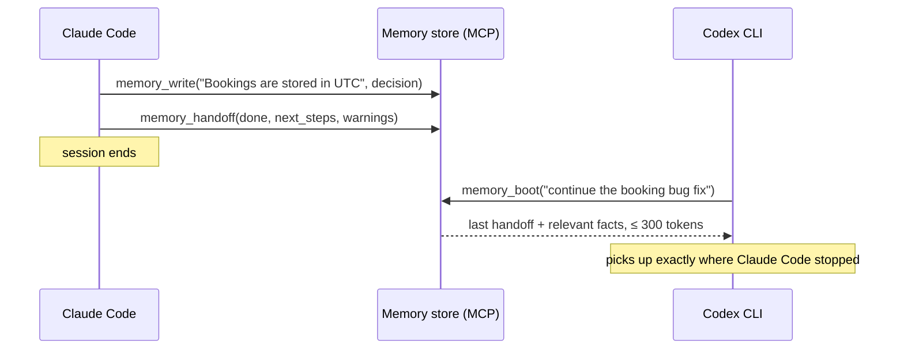

# Agent Memory Engine

**One shared memory for all your coding agents — Claude Code, Codex CLI, Cursor — over MCP, with token-budgeted recall so it never floods a context window.**

Every coding agent forgets everything between sessions, and none of them can read another's notes: what Claude Code learned about your codebase is invisible to Codex, and vice versa. The common fix — a pile of Markdown memory files loaded into every prompt — has the opposite problem: it burns more tokens every week as the pile grows.

This engine is the small piece in between. Agents write atomic facts, decisions and handoffs to one store; at the start of a task any agent recalls **only the memories relevant to that task, under a hard token budget you set**. It runs as a [Model Context Protocol](https://modelcontextprotocol.io) server, so every MCP-capable agent shares the same memory — and every memory records which agent wrote it.

> This engine is the working evolution of the Markdown memory *convention* this repository originally hosted — still included and usable in [`scaffold/`](scaffold/) — into a measured retrieval *system*.

## Results

On a labeled benchmark of an agent working across many sessions on one codebase (14 durable memories, 7 fresh-session tasks, top-k = 3):

| Arm | Avg context tokens | Recall | Precision | Tokens saved vs baseline |
| --- | ---: | ---: | ---: | ---: |
| No memory (control) | 0 | 0.00 | 0.00 | 100% |
| Full context (baseline — load every memory) | 550 | 1.00 | 0.10 | 0% |
| **Semantic recall (this engine)** | **120** | **0.93** | **0.43** | **78%** |
| **Budget recall (≤ 120 tokens, hard cap)** | **113** | **0.93** | **0.43** | **80%** |

**Semantic recall retrieves 93% of the relevant memories while loading 78% fewer context tokens** than dumping every memory file — and under a **hard 120-token cap recall is unchanged**, so the cost of memory stays fixed as the store grows. Numbers are reproduced by `python eval/run_eval.py` and regenerated in CI with the deterministic offline embedder, so they are byte-stable.

## The cross-agent loop



Three habits, three tools:

- **`memory_boot(task, budget_tokens)`** — call once at session start: the latest handoff from the *previous agent, whichever tool it was*, plus the memories most relevant to the task, packed under one token budget.
- **`memory_write(text, type)`** — persist a durable fact, decision or issue the moment it's learned. Near-duplicates are dropped automatically.
- **`memory_handoff(done, next_steps, warnings)`** — call at session end so the next agent continues instead of rediscovering.

Tool outputs are deliberately compact — no scores, no timestamps — because everything a memory tool returns is paid for again in the calling agent's context window.

## Hook it up to your agents

```bash
pip install -e ".[mcp]"
```

Point every agent at the **same store path**, and give each its own name:

**Claude Code**

```bash
claude mcp add agent-memory -e AGENT_MEMORY_PATH=~/.agent_memory/store.json \
  -e AGENT_MEMORY_AGENT=claude-code -- agent-memory-mcp
```

**Codex CLI** (`~/.codex/config.toml`)

```toml
[mcp_servers.agent-memory]
command = "agent-memory-mcp"
env = { AGENT_MEMORY_PATH = "~/.agent_memory/store.json", AGENT_MEMORY_AGENT = "codex" }
```

**Cursor** (`.cursor/mcp.json`)

```json
{
  "mcpServers": {
    "agent-memory": {
      "command": "agent-memory-mcp",
      "env": {
        "AGENT_MEMORY_PATH": "~/.agent_memory/store.json",
        "AGENT_MEMORY_AGENT": "cursor"
      }
    }
  }
}
```

Each memory now carries its origin (`[decision · claude-code]`, `[handoff · codex]`), and a handoff written in one tool is picked up by the next via `memory_boot`.

## How it works

- **Pluggable embedder** ([embeddings.py](src/agent_memory/embeddings.py)) — a small `Embedder` protocol with two backends: a dependency-free, deterministic `HashingEmbedder` (default; runs offline and in CI) and a `SentenceTransformerEmbedder` for real semantic embeddings. Same API, swap by installing one package.
- **Vector store** ([store.py](src/agent_memory/store.py)) — exact brute-force cosine over a numpy matrix, JSON persistence, near-duplicate suppression on write, and greedy **budget packing**: recall walks results in relevance order and skips anything that would overflow the caller's token budget. An agent's memory is hundreds of entries, not millions, so this is instant and exact; FAISS/Chroma can slot behind the same API later.
- **MCP server** ([mcp_server.py](src/agent_memory/mcp_server.py)) — exposes `memory_boot`, `memory_recall`, `memory_write`, `memory_handoff`, `memory_stats` as agent tools.
- **Evaluation harness** ([run_eval.py](eval/run_eval.py)) — measures token cost and retrieval precision/recall across four arms on a labeled dataset, including the hard-budget arm.

## Quickstart (60 seconds)

```bash
pip install -e .            # core engine + CLI (numpy only)
python eval/run_eval.py     # reproduce the results table above

agent-memory --agent claude-code write "Bookings are stored in UTC." --type decision
agent-memory --agent claude-code handoff --done "Fixed double emails." --next "Add rate limiting."
agent-memory boot "continue the rate limiting work" --budget 200
```

In Python:

```python
from agent_memory import MemoryStore

store = MemoryStore(path="~/.agent_memory/store.json")
store.write("The chatbot uses Google Gemini in server/gemini-chat.ts.",
            type="decision", agent="claude-code")
for hit in store.recall("where is the chatbot configured", k=3, budget_tokens=150):
    print(hit.score, hit.entry.text)
```

## Real semantic embeddings

```bash
pip install -e ".[real]"    # sentence-transformers + tiktoken
```

`default_embedder()` automatically prefers the real model when installed. Force the offline embedder anywhere with `AGENT_MEMORY_EMBEDDER=hashing` (CI does this for stable numbers).

## Migrate an existing Markdown scaffold

```bash
python scripts/ingest_markdown.py path/to/agent-memory/   # one memory per file/section
```

## Develop

```bash
pip install -e ".[dev]"
pytest -q
```

## Design notes

- **Small on purpose.** A memory layer that itself eats context defeats its point. Recall output is compact, budget-capped, and score-free; the whole engine is a few hundred lines with one required dependency (numpy).
- **Offline-safe by default.** No model download or network needed to run, test, or evaluate — the heavy backends are optional extras. This keeps CI deterministic and the repo cloneable-and-runnable in one step.
- **Honest evaluation.** The benchmark is small and labeled by hand; the one missed memory (`task_1`) is reported rather than tuned away. The harness includes a no-memory control and a full-context baseline so the comparison is fair.
- **Boring where it counts.** Brute-force exact search instead of an ANN index, JSON instead of a database — chosen deliberately for the actual scale and swappable behind the same API.

## Roadmap

- LLM-based compaction: summarize/dedup `state` and `worklog` memories, extract durable facts from a raw session transcript.
- Recency- and type-aware ranking (decay old `state`, never drop `decision`).
- `sentence-transformers` numbers published alongside the hashing baseline in CI.
- Optional FAISS backend for large stores.

## License

MIT
