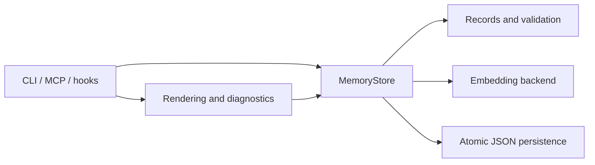

# Agent Memory Engine

[](https://github.com/Ninadnj/agent-memory-engine/actions/workflows/ci.yml)
[](https://www.python.org/downloads/)
[](LICENSE)

**Local project memory that coding agents can share, inspect and correct.**

Keep architectural decisions, bug findings and session handoffs in one project store. Retrieve relevant notes within a text token budget. When a decision changes, retain its history and keep stale agents from overwriting the correction.

Designed for developers switching between coding agents or returning to a project after a break, the engine provides a Python library, CLI and local MCP server. No model API key or database service is required. The default retriever matches words and character fragments; an optional local model adds semantic retrieval.

The workflow is simple: **recall context → work → save durable facts and a handoff**. Memories are explicitly written by you or your agent. This is not automatic learning from every conversation, and stored claims still need verification.

**Status: v0.4.0rc2, a release candidate.** The instructions below install this checkout, not a published stable release. Existing format-3 stores need no conversion; Python callers should read the [migration notes](docs/migration-v0.4.md).

Use this when several agents need selective retrieval and traceable corrections. If a few short, maintained Markdown files already solve your problem, keep them.

## Architecture at a glance


```mermaid
flowchart LR
    Clients[CLI / MCP / hooks] --> Context[Rendering and diagnostics]
    Clients --> Store[MemoryStore]
    Context --> Store
    Store --> Records[Records and validation]
    Store --> Embeddings[Embedding backend]
    Store --> Disk[Atomic JSON persistence]
```

One Python package, one project store, one implementation of memory operations. All client adapters share the same core. The only required dependency is NumPy.

The CLI, MCP server and hooks translate requests. Rendering builds the returned context. [`store.py`](src/agent_memory/store.py) coordinates memory operations, [`models.py`](src/agent_memory/models.py) defines records and validation, and [`persistence.py`](src/agent_memory/persistence.py) reads and atomically replaces the JSON file. These are modules, not separate services.

The design prioritizes safe corrections and predictable behavior: stale edits are rejected when a revision is supplied, failed writes roll back, and returned Python records cannot mutate the store. The [architecture guide](docs/architecture.md) explains the write flow, locking and tradeoffs.

## Try it in five minutes

You need Python 3.10+ and Git. On macOS/Linux:

```bash
git clone https://github.com/Ninadnj/agent-memory-engine.git
cd agent-memory-engine
python -m venv .venv
source .venv/bin/activate
python -m pip install -e ".[mcp]"
python examples/handoff_demo.py
```

On Windows PowerShell, use `.venv\Scripts\Activate.ps1` instead of the `source` line. If your system uses `python3`, substitute it for `python`.

The demo starts **two real MCP server processes** against a temporary store. Its output:

```text
1. Agent B receives Agent A's decision and handoff over MCP.
2. Agent A's stale deletion is rejected: expected revision 1, current 2.
3. A replacement decision is recalled; the old decision and its revisions remain inspectable.
All checks passed. Two server processes; one temporary store; no model calls.
```

An expected stale-revision error may also appear in the logs: the demo deliberately attempts an outdated deletion and verifies that it is rejected. It uses a temporary store and makes no model calls. This tests the protocol, not an LLM's ability to use memory.

### Use it in your own project

With the environment still active, **change into the Git project you want to remember**, then run:

```bash
agent-memory --agent developer write "Bookings are stored in UTC; the UI converts to local time." --type decision
agent-memory recall "booking timezone UTC" --budget 200
agent-memory doctor
agent-memory recall "booking timezone UTC" --budget 200 --explain
```

The store is created on the first write. Inside a Git project, its default path is `.agent_memory/store.json` at the repository root. Outside Git, the default is `~/.agent_memory/store.json`.

`--path` or `AGENT_MEMORY_PATH` selects an explicit store. Give every client the **same absolute path** when they should share memory. Add `.agent_memory/` to that project's `.gitignore`; memories can contain private project details.

## Correct a memory without losing the explanation

```python
from agent_memory import HashingEmbedder, MemoryStore

store = MemoryStore(".agent_memory/store.json", embedder=HashingEmbedder())
old = store.write(
    "Queue retries are limited to three attempts.",
    type="decision",
    source={"path": "queue/policy.py"},
    agent="reviewer",
)
new = store.supersede(
    old.id,
    "Queue retries are limited to five attempts.",
    expected_revision=old.revision,
    agent="implementer",
)
assert store.get(old.id).superseded_by == new.id
```

Use `update` to correct the same memory, `supersede` to replace it while retaining the old record, and `forget` to permanently delete it. MCP and CLI edits require the revision you read. In Python, `update` and `forget` allow the revision to be omitted; **always pass it when multiple callers can edit**. `supersede` requires it. The last 20 prior revisions are retained; forgetting removes the entry and its history from the current store.

Python methods return independent snapshots. Editing their fields changes only that local copy; calling `save()` afterward does not persist those edits. Use `store.update(...)` or `store.supersede(...)`. An earlier snapshot keeps its original revision even after another caller updates the store.

CLI equivalents, replacing `MEMORY_ID` and revision with values from `list`:

```bash
agent-memory list
agent-memory inspect MEMORY_ID
agent-memory update MEMORY_ID "Corrected fact." --expected-revision 1
agent-memory supersede MEMORY_ID "Replacement decision." --expected-revision 2
agent-memory export backup.json
```

Sources can include a project-relative `path`, Git `commit`, `event`, or caller-supplied `verified_at`. Inspection flags a file that changed since its recorded commit. These references help investigation; they do not certify that a memory is true.

## Connect a coding agent

See [client setup](docs/clients.md) for Claude Code, Codex CLI and Cursor. Configure the absolute path to the installed `agent-memory-mcp` executable and the project store. The client launches the server over stdio; no HTTP service or port is needed. Agent use of the tools depends on the client and model—it is not guaranteed to happen automatically.

| Task | MCP tool |
| --- | --- |
| Start a session | `memory_boot(task, budget_tokens=300)` |
| Find relevant notes | `memory_recall(query, k=5, budget_tokens=300)` |
| Save a fact with a source | `memory_write(text, type="fact", source=...)` |
| Leave the next session a starting point | `memory_handoff(done, next_steps, warnings="")` |
| Inspect identity, source and history | `memory_get(id)`, `memory_list()` |
| Correct or replace a decision | `memory_update(...)`, `memory_supersede(...)` with `expected_revision` |
| Permanently remove a memory | `memory_forget(id, expected_revision)` |
| Inspect store totals | `memory_stats()` |

Optional Claude Code hooks inject fresh startup notes and record observed Git changes. Install with `agent-memory install-hooks`; enable per-prompt recall with `--with-prompt-recall`. Hooks are fallible observations and do not establish who authored a change.

## Correctness and limits

- New IDs use `mem_` plus UUID4. Deletion cannot reset an ID counter. Unique explicit IDs and legacy `mem_0001` IDs remain usable; duplicate explicit IDs are rejected.
- Mutations reload under an OS lock and replace the JSON file atomically. Failed writes roll back the local snapshot. This contract covers cooperating v0.4 processes on a local filesystem.
- A per-store thread lock prevents concurrent calls from seeing partially applied changes. Returned records include independent copies of nested metadata and history.
- Startup selects its handoff and relevant memories from one snapshot. A concurrent correction appears on the next call, rather than mixing old and replacement notes in one response.
- Correction revisions reject stale edits. Superseded notes leave normal recall; old handoffs and worklogs leave startup context. Exact duplicates are skipped only within the same type and source; similar wording never silently merges a contradiction.
- MCP/CLI context budgets include the returned text's labels, IDs and source references. `cl100k_base` is used when tiktoken is installed, otherwise counting is approximate. Client wrappers, tool schemas and full session usage are outside this budget. The Python store API budgets memory bodies only.

The intended workload is **hundreds of memories per project**. Writes replace the whole JSON file; recall scores all stored vectors. There is no cloud sync, authorization layer or distributed-storage guarantee. Memory content may reach your coding agent's provider: treat it as fallible data, never executable instructions.

## Verification and evidence

[CI](https://github.com/Ninadnj/agent-memory-engine/actions/workflows/ci.yml) tests Linux, macOS and Windows, Python 3.10/3.12, both supported MCP SDK majors, packaging and clean installation. Tests cover revisions, concurrent access, rollback, legacy stores, token budgets and real MCP calls. See the [verification record](docs/verification-rc2.md) for results and scope.

- **Retrieval diagnostic:** [14 memories and seven queries](eval/results.md). Literal-query recall is 0.93; paraphrase recall is 0.43. This small benchmark exposes the offline retriever's limitations, not improved coding performance.
- **Evaluation infrastructure:** [30 executable tasks](docs/evaluation.md) across three synthetic projects. All [task graders are validated](eval/fixture-validation.json); this is not an agent-success result.
- **Still unverified in this candidate:** the optional semantic model, live coding-client sessions, and the live-agent comparison. No whole-session token-savings or coding-performance claim is made.

## Install options

Run these from the cloned repository, with its environment active:

| Installation | Contents |
| --- | --- |
| `python -m pip install -e .` | Python library and CLI; NumPy only |
| `python -m pip install -e ".[mcp]"` | Adds the MCP server |
| `python -m pip install -e ".[real,mcp]"` | Adds optional sentence-transformers embeddings and tiktoken; first model use can download weights |
| `python -m pip install -e ".[dev]"` | Tests, MCP, exact tokenizer and build tools |

New stores use offline hashing by default, even if semantic packages are installed. Set `AGENT_MEMORY_EMBEDDER=sentence-transformers` to opt into semantic retrieval, or pass an explicit embedder in Python. An unset value (or `auto`) reuses an existing v0.4 store's saved backend and model configuration. Unknown values fail with an actionable error. Configuration changes trigger re-embedding; immutable model revisions are recommended for reproducibility.

## Development and existing notes

After installing the `dev` extra, run:

```bash
python -m pytest -q
ruff check src tests eval scripts examples
ruff format --check src
```

See [Contributing](CONTRIBUTING.md) for the full checks. Keep changes small and backed by regression tests; a database migration or automatic summarizer needs a measured reason.

The original Markdown convention remains in [scaffold/](scaffold/). Import existing notes with `python scripts/ingest_markdown.py path/to/notes --path .agent_memory/store.json`; oversized sections are split into bounded chunks.

[Architecture](docs/architecture.md) · [Migration](docs/migration-v0.4.md) · [Evaluation](docs/evaluation.md) · [Contributing](CONTRIBUTING.md) · [Security](SECURITY.md) · [Changelog](CHANGELOG.md) · [Release checks](docs/release.md)
