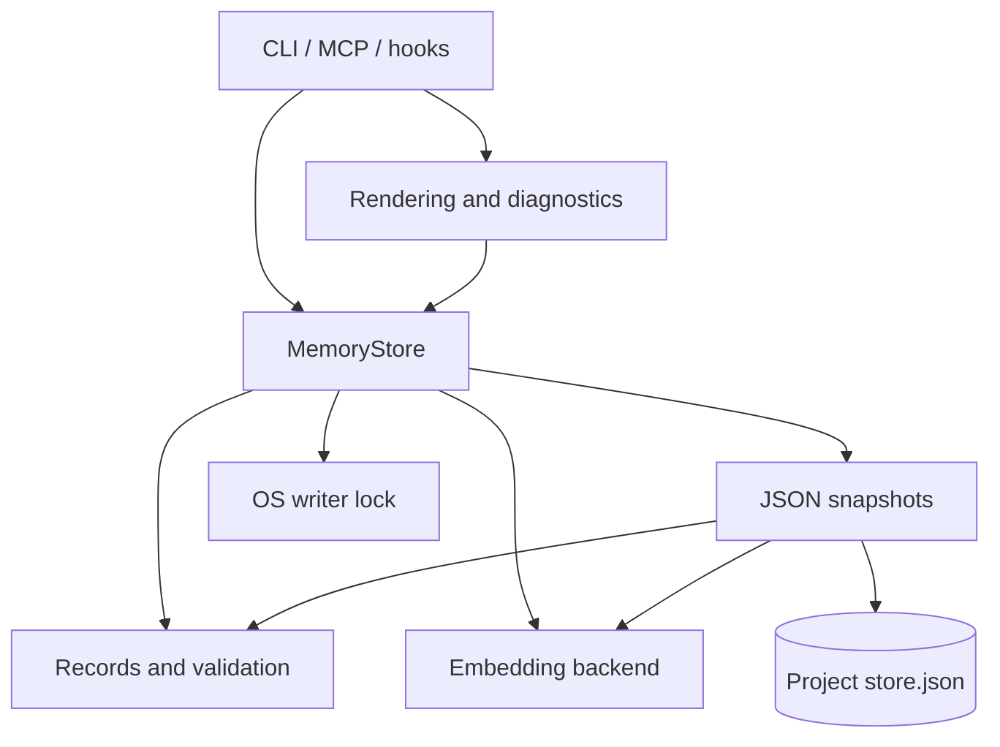

# Architecture

Agent Memory Engine is a local Python library with CLI, MCP and hook adapters.
Its job is to preserve useful project knowledge, retrieve a small relevant
context, and make corrections safe when several agents share the store.

## Responsibilities

These are module boundaries inside one package, not separate services.

| Role | Modules | Responsibility |
| --- | --- | --- |
| Interfaces | `cli.py`, `mcp_server.py`, `hooks.py` | Translate commands, tool calls and client events into memory operations. |
| Presentation | `rendering.py`, `diagnostics.py` | Pack complete context blocks, explain selection and inspect source references. |
| Engine | `store.py` | Own entries and vectors; coordinate writes, revisions, supersession, retrieval and transactions. |
| Records | `models.py` | Define memory records, input validation, history limits and freshness rules. No disk access or model loading. |
| Infrastructure | `persistence.py`, `_locking.py`, `embeddings.py`, `tokens.py` | Encode/decode JSON, replace files safely, lock writers, embed text and count tokens. |

The engine never imports a client adapter. Persistence never decides which
memory should change. All clients use the same core operations. Public imports
such as `from agent_memory import MemoryStore, MemoryEntry` stay stable.



`eval/`, `tests/`, `scripts/` and `examples/` are development and demonstration
tools. They do not become runtime dependencies of the package.

## A write, step by step

1. Acquire the store's thread lock and validate input.
2. Acquire the OS writer lock and reload any change made by another process.
3. Check the expected revision, if supplied. Reject stale edits before mutation.
4. Compute the embedding and apply the change to the in-memory snapshot.
5. Validate and serialize the complete snapshot, flush and fsync a temporary
   file, then atomically replace the JSON file.
6. Return an independent copy of the result. If a mutation or save fails,
   restore the prior entries, vectors and file stamp before releasing the lock.

There are two locks because they protect different things. The reentrant thread
lock protects one store object, including readers and in-memory stores. The OS
lock serializes writers in separate processes using the same file. A concurrent
reader of the same object cannot see a write that later rolls back. Separate
processes read either the previous complete file or the new complete file.

The OS releases its lock when a process exits. A persistent `.guard` file names
the lock; its existence does not mean a writer is active. Windows replacement
retries cover brief file-sharing conflicts. This contract is for cooperating
v0.4 processes on a local filesystem, not network shares or mixed-version writers.

## Identity, snapshots and corrections

Generated IDs use UUID4, independent of the number of remaining records. Legacy
and explicit unique IDs remain usable. `write` skips only exact text after
whitespace normalization with the same type and source; `deduplicate=False`
explicitly stores another occurrence. Similar wording cannot silently merge
a contradiction.

Every public method returns detached records, including nested metadata, sources
and history. A local edit cannot leave the stored text and embedding out of sync.
An earlier read also retains its earlier revision:

```python
earlier = store.get(memory_id)       # revision 1
store.update(memory_id, "Corrected fact.", expected_revision=1)
assert earlier.revision == 1        # the earlier read has not changed
# Deleting with expected_revision=earlier.revision now raises MemoryConflictError.
```

`update` preserves identity and records the prior revision. `supersede` creates
a replacement identity and retires the old record in the same transaction.
Normal recall excludes retired records; inspection still exposes their history.
The last 20 prior revisions are retained. `forget` removes a record and its
history from the current store; backups are separate copies.

Revision checks are required in CLI/MCP edits and optional in Python for
compatibility. Use them for all Python edits involving multiple callers.
Source checks compare a project-relative file with a recorded Git commit;
they are evidence for review, not proof that the memory's claim is true.

## Retrieval and context

Recall embeds the query, scores the matrix by dot product, applies age decay to
state/handoff/worklog records, filters retired or weak matches, and returns the
best candidates. Durable decisions and facts do not decay. Startup additionally
excludes handoffs older than 14 days and worklogs older than 42 days.

The Python store budget counts memory bodies. CLI/MCP rendering counts complete
blocks, including IDs, dates, source references and separators. If a block is
too large, it tries the next candidate instead of truncating a warning or fact.
`cl100k_base` is used when tiktoken is available; the fallback is approximate.
Tool schemas, protocol envelopes and client wrappers are outside this text budget.

New stores default to offline feature hashing. Semantic embeddings are explicit
and optional. Existing stores retain their recorded backend unless overridden;
a changed configuration causes re-embedding. A floating model name cannot
detect changed remote weights, so pin an immutable revision when reproducing results.

## Why this stays small

| Decision | Benefit | Cost / limit |
| --- | --- | --- |
| JSON + NumPy | Easy installation, inspection, backup and recovery. | Every write rewrites the file; scoring scans all vectors and ranking sorts them. |
| One concrete store | One place to understand memory behavior. | A different backend would need a measured reason and a migration. |
| Detached snapshots | Clear ownership and reliable revision checks. | Returned records and nested history must be copied. |
| Explicit semantic opt-in | Predictable offline startup and dependencies. | Hashing misses synonyms and paraphrases. |
| Thin adapters | Consistent behavior across clients. | Client-specific protocol and event handling still need tests. |

The intended workload is hundreds of project memories. The file limit is
128 MiB; it is a validation guard, not a performance promise. Measure actual
latency and contention before adding a database, vector index, background worker
or model-driven summarizer. The [evaluation guide](evaluation.md) separates
retrieval diagnostics, grader validation and live-agent evidence.
