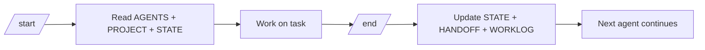

# Lightweight AI Agent Memory Scaffold

> **Note:** this Markdown convention has evolved into a measured retrieval system — the [agent-memory-engine](../README.md) at the root of this repository. The scaffold below remains fully usable on its own.

A lightweight Markdown scaffold for AI coding agent context, memory, workflows,
and handoffs.

## Repository Description

Switch between AI coding agents without losing context, duplicating instructions, or
loading unnecessary history.

AI Agent Memory Scaffold is a lightweight Markdown-based context system for AI
coding agents. It gives agents shared rules, project facts, current state,
decisions, known issues, workflows, and handoff notes so they can continue work
safely across sessions and tools.

This repo is for developers who use tools like Codex, Claude Code, Gemini, or
other coding agents in the same project. It gives agents a small set of files
for shared behavior rules, project facts, current state, workflow guidance,
handoff notes, decisions, known issues, and compact work history.

It is not a framework. It does not run code, install dependencies, manage a
database, or automate your workflow.

## Who This Is For

- Developers using multiple AI coding agents in the same repo.
- People switching between Codex, Claude Code, Gemini, and similar tools.
- Solo builders who need project continuity between sessions.
- Teams that want safer AI handoffs.
- People who want safer AI coding sessions and cleaner context between tools.
- Teams that want repeatable agent workflows with less token waste.
- Anyone who needs better continuity across AI coding agents.
- Anyone tired of pasting the same context repeatedly.

## What Problem It Solves

AI coding agents often lose context when you switch tools or start a new session.
The usual workaround is to paste long summaries or reload too much history.

This scaffold keeps the important working context in plain Markdown files so
agents can read only what they need:

- shared behavior rules
- stable project facts
- current active task
- task-specific workflow guidance
- next handoff step
- durable decisions
- unresolved issues
- compact completed history

`AGENTS.md` remains the source of truth for agent behavior. The other files
provide memory, prompts, and optional task workflows.

## What This Repo Gives Agents

- shared behavior rules through `AGENTS.md`
- stable project facts through `PROJECT.md`
- current work state through `STATE.md`
- handoff notes through `HANDOFF.md`
- durable decisions through `DECISIONS.md`
- unresolved problems through `KNOWN_ISSUES.md`
- compact history through `WORKLOG.md`
- repeatable session flow through `commands/start.md` and `commands/end.md`
- task-specific guidance through `workflows/`

## Why Not Just Use Chat History?

Chat history is useful, but it is noisy, tool-specific, and hard to transfer
between agents.

This scaffold keeps only the durable working context:

- project facts
- active task
- decisions
- known issues
- workflow rules
- next steps

It is not meant to replace chat history. It is meant to reduce dependency on it.

## Folder Structure

```text
AGENTS.md
CLAUDE.md
HOWTOUSE.md
commands/
  start.md
  end.md
agent-memory/
  PROJECT.md
  STATE.md
  HANDOFF.md
  DECISIONS.md
  KNOWN_ISSUES.md
  WORKLOG.md
workflows/
  debug.md
  refactor.md
  deploy.md
```

## Quick Start

1. Use this repo as a template or copy the files into an existing repo.
2. Fill in `agent-memory/PROJECT.md` with verified stable facts from your repo.
3. Use `/start` before an agent session, if supported.
4. Use `/end` before stopping or switching agents, if supported.
5. Let the next agent read the memory files before continuing.

If slash commands are not supported, paste `commands/start.md` or
`commands/end.md` into the agent.

## Example Workflow

```text
/start -> read AGENTS.md + PROJECT.md + STATE.md -> work -> /end -> update STATE.md + HANDOFF.md + WORKLOG.md
```



## Tool Compatibility

| Tool | How to use this scaffold |
| --- | --- |
| Codex | Ask it to read `AGENTS.md` and follow the read policy. |
| Claude Code | Uses `CLAUDE.md` as a pointer to `AGENTS.md`. |
| Gemini | Paste `commands/start.md` or `commands/end.md` manually if slash commands are not supported. |
| Any coding agent | Read `AGENTS.md`, then load only the memory files needed for the current task. |

## Start A Session

At the beginning of a session, the agent should:

- read `AGENTS.md`
- follow the Read Policy in `AGENTS.md`
- read `agent-memory/PROJECT.md`, `STATE.md`, and `HANDOFF.md` for
  non-trivial work
- summarize project context, active task, and next safe step
- inspect relevant files before editing

Use `commands/start.md` as a portable prompt when native slash commands are not
available.

## End A Session

Before stopping or switching agents, the agent should:

- compact `agent-memory/STATE.md`
- rewrite `agent-memory/HANDOFF.md`
- append `agent-memory/WORKLOG.md` only if the repo changed meaningfully
- avoid updating `PROJECT.md` unless stable verified facts changed
- avoid updating `DECISIONS.md` unless a durable decision was made

Use `commands/end.md` as a portable prompt when native slash commands are not
available.

## Copy Into Existing Repo

```bash
git clone https://github.com/Ninadnj/agent-memory-engine.git

cp agent-memory-engine/scaffold/AGENTS.md ./AGENTS.md
cp agent-memory-engine/scaffold/CLAUDE.md ./CLAUDE.md
cp -R agent-memory-engine/scaffold/agent-memory ./agent-memory
cp -R agent-memory-engine/scaffold/commands ./commands
cp -R agent-memory-engine/scaffold/workflows ./workflows
```

After copying, fill in `agent-memory/PROJECT.md`, clear or rewrite
`STATE.md` and `HANDOFF.md`, then commit the scaffold into your project.

## Example STATE.md

```md
# STATE.md

## Active Task

- Task: Add password reset email copy.
- Status: implementing
- Owner agent: Codex
- Started: 2026-05-13

## Current Understanding

- Auth routes already exist.
- Email templates live in `emails/`.

## Files In Scope

- `emails/password-reset.md`
- `src/auth/reset.ts`

## Next Step

- Update the email copy and run the existing auth tests.

## Blockers

- None.
```

## Example HANDOFF.md

```md
# HANDOFF.md

## Last Session Summary

- Updated password reset email copy.
- Confirmed the reset token link still uses the existing helper.

## Current Status

- Status: verifying
- Last completed step: copy update
- Next recommended step: run auth email tests
- Blocker: none

## Files Changed Recently

- `emails/password-reset.md` - revised user-facing copy

## Verification

- Not run yet.
```

## Memory Model

`STATE.md` and `HANDOFF.md` are current working context. They should be
rewritten and compacted as work changes.

`PROJECT.md`, `DECISIONS.md`, `KNOWN_ISSUES.md`, and `WORKLOG.md` are collected
context over time:

- `PROJECT.md` stores only verified stable project facts.
- `DECISIONS.md` stores only durable architecture, product, data, security, or
  deployment decisions.
- `KNOWN_ISSUES.md` stores only unresolved problems.
- `WORKLOG.md` stores compact completed-task history and should stay short.

Do not load `WORKLOG.md` by default. Use it only when historical context is
needed.

## What Not To Store

Do not store:

- secrets
- API keys
- tokens, passwords, or private keys
- private customer data
- huge logs
- temporary noise
- full chat transcripts
- raw logs
- speculative notes
- duplicate summaries
- stale guesses
- personal commentary
- sensitive client, production, or operational details

Use placeholders for examples. Store only context that helps the next agent work
safely.

## Adapting This In Another Repo

Keep the structure simple:

- Make `AGENTS.md` the primary rules file.
- Update `agent-memory/PROJECT.md` with verified project facts.
- Keep `STATE.md` focused on the current active task.
- Keep `HANDOFF.md` focused on the exact next step.
- Load workflow docs only for matching debug, refactor, or deploy work.
- Add project-specific rules only when they are durable and useful.

Avoid adding scripts, databases, dependencies, or automation unless your own
project clearly needs them.

## Recommended GitHub Settings

These are manual GitHub UI steps:

- Mark this repository as a Template repository.
- Add repository topics:
  - `ai-agents`
  - `coding-agents`
  - `agent-memory`
  - `codex`
  - `claude-code`
  - `gemini`
  - `developer-tools`
  - `template`
  - `handoff`
  - `markdown`
- Create a first release such as `v0.1.0` when the scaffold is stable.
